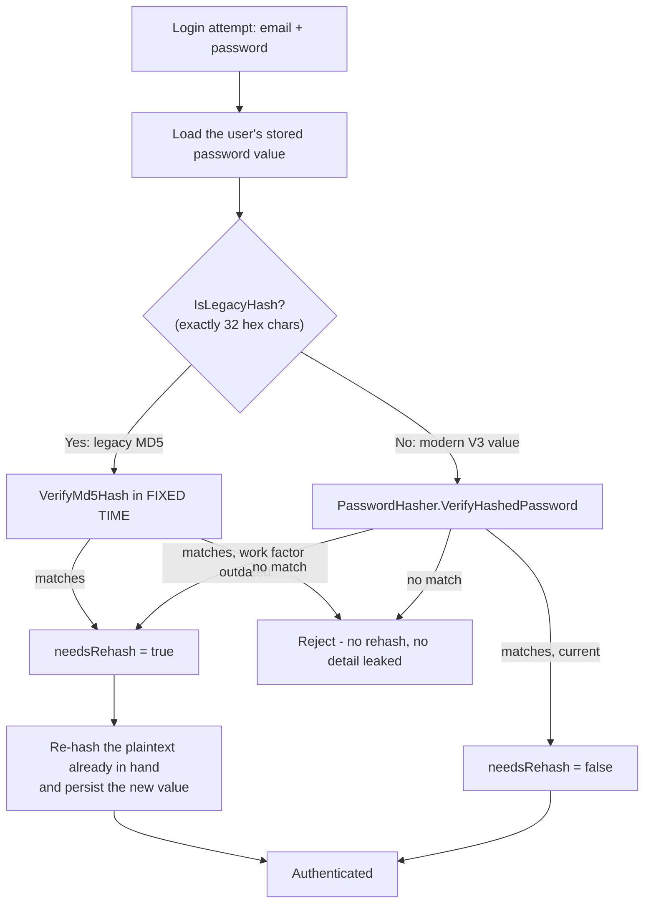

# Credential Migration

How stored password credentials move from the legacy unsalted MD5 format to the modern salted,
work-factored format; what happens to existing users; and what an operator has to do.

Findings are described in the [security audit report](security-audit-report.md), the changes in the
[remediation log](remediation-log.md), accepted deviations in the [risk register](risk-register.md),
and the settings this depends on in the [secure configuration guide](secure-configuration.md).

## The short version

- **No user is locked out and no password reset is forced.** A legacy value still authenticates, and
  the successful login that accepts it immediately rewrites the stored value in the new format.
- **Nothing to run, nothing to schedule.** The upgrade happens per user, on that user's next
  successful authentication.
- **No schema change.** The password column is already `varchar(500)`; the new value is 84 characters.
- **Login is deliberately slower.** 600,000 PBKDF2 iterations cost roughly a third of a second per
  attempt. That cost is the control, not a regression.

## Status at this commit

Measured against the tree rather than asserted:

| Aspect | State |
| --- | --- |
| Storage primitive | PBKDF2-HMAC-SHA256, 600,000 iterations, 16-byte CSPRNG salt per credential, 32-byte subkey, self-describing versioned payload, fixed-time comparison via `CryptographicOperations.FixedTimeEquals` |
| Where it is implemented | `WebVella.Erp/Utilities/PasswordUtil.cs` — derived in-file with `Rfc2898DeriveBytes.Pbkdf2`, so the core library needs no ASP.NET Core dependency for it |
| Write paths using it | `WebVella.Erp/Database/DbRecordRepository.cs:L557` and `:L1893`; `WebVella.Erp/Api/RecordManager.cs:L2025` |
| Verification path using it | `WebVella.Erp/Api/SecurityManager.cs` — `IsLegacyHash` at `:L158`, `VerifyPassword` at `:L161`, the legacy upgrade at `:L250` |
| Comparison inside the SQL predicate | **Removed.** The credential query selects on an anchored exact e-mail pattern only |
| Account-enumeration timing | Equalised — `PasswordUtil.PerformDummyVerification` at `SecurityManager.cs:L380` spends one key derivation even when no account matches |
| Oversized-input bound | 128 characters, enforced at all four entry points before any scan, encode, digest or derivation |
| Legacy MD5 acceptance | Retained deliberately, and reported by the analyzer gate as `CA5351` — accepted as `RISK-004` |
| Seeded administrator credential | **Changed in a later pass.** `WebVella.Erp/ERPService.cs` no longer assigns the literal `"erp"`: it resolves the initial administrator password from `Settings:InitialAdministratorPassword`, or generates a 20-character password (~120 bits) with `RandomNumberGenerator.GetItems<char>` and surfaces it exactly once at provisioning. **Two further changes landed at the code-review checkpoint** (finding `F-05`): an operator-supplied value must now satisfy a **12–128 character policy with all four character classes** or startup fails fast, and a **change-required-on-first-login marker is now set and enforced** — carried in the existing `rec_user.preferences` column, so the earlier claim that this needed a forbidden schema change was wrong. `RISK-027` is **closed** |
| Password length bounds, guest-role grants and the data migration | **Landed in a later pass.** The bounds in `WebVella.Erp/ERPService.cs` are now **12–128** (finding M-13), the guest-role create grants on the user and role entities are **removed** (findings C-05 and C-02), and the **schema version 4 data migration has been added** — the core schema version head is now `4`. Sections further down that still describe these as planned are superseded by [§ Schema version 4 — as landed](#schema-version-4-as-landed). The ladder head **stops at 4**: a version-5 gate that revoked the Guest role’s read grant on role metadata was added in a later pass and has since been **removed** as outside the frozen scope, so review finding `F17` is documented rather than migrated — see [§ The migration ladder head is 4](#the-migration-ladder-head-is-4-and-why-it-stops-there). **Consequence for operators:** an **already-deployed** installation is now remediated on upgrade, not merely a freshly provisioned one. The administrator credential is invalidated automatically *only* if it still carries the previously published default; a password the operator already changed is detected and left untouched |

## How this guide is organised

The migration was documented from four angles and all four are reproduced, because each carries
detail the others do not.


## The migration in detail — what changes, how it works, and the status at this commit

How WebVella ERP's stored password format changes, what happens to existing users' credentials, what
an operator has to do, and how to roll back.

The companion documents are the [security audit report](security-audit-report.md), the
[remediation log](remediation-log.md), the [risk register](risk-register.md) and the
[secure configuration guide](secure-configuration.md).

**The short version.** Passwords were stored as unsalted MD5 digests (finding C-03 — CWE-916,
CWE-759, OWASP A02:2021). They are being replaced by salted, work-factored PBKDF2 values. The change
is **backward compatible by design**: verification accepts either format, and a legacy value is
upgraded silently the next time its owner logs in successfully. **No user is locked out, no password
reset is forced, and there is no downtime.**

---

### 1. What changes

| | Before | After |
| --- | --- | --- |
| Algorithm | MD5, one pass | PBKDF2-HMAC-SHA512 |
| Salt | **None** | 128-bit, cryptographically random, fresh per hash |
| Iterations | 1 | **600,000** |
| Format | 32 lower-case hexadecimal characters | ASP.NET Core Identity **V3** encoded value, roughly 84 Base64 characters |
| Produced by | a shared, mutable `MD5` instance | `PasswordHasher<object>` from the ASP.NET Core shared framework |
| Comparison | string equality, **inside a SQL predicate** | fixed-time comparison, in application code |

Two secondary findings close as a by-product of the same change: the shared mutable hash instance
(finding M-06 — CWE-362, a data race that could interleave two callers' digests) and the
non-constant-time comparison (finding M-05 — CWE-208).

#### No schema change is required

The `password` column is provisioned as `varchar(500)` by the platform's type converter, and the
encoded PBKDF2 value is roughly 84 characters. It fits with a wide margin, so **no column is altered
and no column is added.**

No discriminator column is needed either. The format of a stored value is inferable from its shape: a
legacy value is exactly 32 hexadecimal characters, which a Base64-encoded V3 value can never be. That
test is a single member, `IsLegacyHash`.

#### Why 600,000 iterations, and why PBKDF2

The engagement's cryptographic standard names bcrypt, scrypt or Argon2 at a cost factor of 12 or
above. PBKDF2 is none of those three, and the deviation is deliberate and disclosed rather than
glossed over:

* The authoritative OWASP password-storage guidance **explicitly sanctions PBKDF2** at a high
  iteration count, so this is a permitted choice rather than a compromise.
* It satisfies the standard's unambiguous intent — slow, salted, work-factored, fixed-time
  verification.
* It ships inside the `Microsoft.AspNetCore.App` framework reference the core project already has, so
  it adds **no new package dependency**. The remediation constraints prefer the least invasive
  control, and adding a bcrypt or Argon2 package would not have been that.
* The platform vendor's own guidance steers applications that store password hashes toward this
  component rather than raw key-derivation calls.

The iteration count is the control, not a tuning knob. The framework default is 100,000; the OWASP
floor for PBKDF2-HMAC-SHA512 is 210,000; this uses 600,000. **Do not lower it to chase a latency
target.**

If literal compliance with the named algorithms is required by your own policy, substituting a
dedicated bcrypt or Argon2 package is available as a repository-owner option. It is deliberately
escalated rather than decided here, and belongs in the [risk register](risk-register.md) alongside the
engagement's other owner decisions.

#### The performance cost is intentional

Each hash and each verification costs roughly **380 ms of CPU**, measured. That is the entire point of
a work factor: it makes offline guessing expensive. Login is measurably slower **by design**. The
figure is a *contemporaneous observation* taken on a heavily contended shared host — see the [evidence-provenance table](remediation-log.md#evidence-provenance)
— so the design intent it demonstrates is the durable claim, not the millisecond value.

This is a pre-declared, accepted trade-off, not a regression to be investigated:

* Only the authentication path pays it. No other request path is affected.
* It is bounded per login attempt, so it also raises the cost of online guessing — which is
  complementary to the account-lockout control.
* Plan capacity for it if you authenticate at high volume: 600,000 iterations of PBKDF2-HMAC-SHA512
  is a deliberate CPU cost on every login, and it is serialised per request.

---

### 2. How the migration works

The pattern is **verify-then-upgrade**, which is the work-factor upgrade approach the OWASP
password-storage guidance prescribes: wait until the user next authenticates, then re-hash. It is why
this change can be backward compatible at all — MD5 is one-way, so stored digests cannot be converted
in bulk without the plaintexts, which nobody has.



The plaintext is available at exactly one moment — during a successful login — so that is when the
upgrade happens. Nothing is stored to make it possible later.

#### The primitive

`WebVella.Erp/Utilities/PasswordUtil.cs`. All members are assembly-internal, as they were before, so
**no public API surface changes**:

| Member | Purpose |
| --- | --- |
| `HashPassword(password)` | Produces a modern value. Returns a **different result every time** for the same input, because the salt is fresh — so the result must never be compared for equality, and in particular never inside a SQL predicate. Returns `string.Empty` for a null, empty or whitespace password: fail-closed, because an empty stored value can never verify. |
| `VerifyPassword(password, storedHash, out needsRehash)` | Verifies against **either** format and reports whether the stored value should be upgraded. |
| `IsLegacyHash(storedHash)` | The format discriminator. |
| `VerifyMd5Hash(input, hash)` | Legacy verification in fixed time. Retained on purpose — it *is* the migration path. |
| `GetMd5Hash(input)` | **Legacy support only.** Retained so credentials written by earlier versions remain verifiable. It no longer uses a shared mutable instance. |

A malformed stored value — neither a valid legacy digest nor a valid V3 value — must **fail
verification rather than throw**, so a corrupted row cannot become a denial of service on the login
path.

#### The enabling change: the credential query must be restructured

This is the part that is easy to underestimate. `SecurityManager.GetUser` currently hashes the
supplied password and compares it **inside the SQL predicate**:

```sql
SELECT *, $user_role.* FROM user WHERE email ~* @email AND password = @password
```

**A salted hash cannot be compared by SQL equality.** Every hash of the same password is different, so
this query can never match a modern value. The lookup therefore *has* to become: fetch the user by
email, then verify in application code, then conditionally re-hash and persist. That restructure is
not optional polish — it is what makes salted hashing possible at all.

It closes a second finding for free. The `~*` operator is a case-insensitive **regular-expression**
match, so an attacker-supplied email is evaluated as a regex pattern (finding H-17 — CWE-1333,
regular-expression denial of service). Replacing it with an exact comparison removes that exposure.
The change is semantically safe because an exact case-insensitive email comparison already runs in
application code immediately after the query — the loop that follows it re-checks
`rec["email"].ToLowerInvariant() == email.ToLowerInvariant()`, so the loose predicate was never the
effective match to begin with.

---

### 3. Status at this commit

Disclosed precisely, because an operator planning a migration window needs to know whether it has
started:

| Component | Status |
| --- | --- |
| The modern primitive in `PasswordUtil` — `HashPassword`, `VerifyPassword`, `IsLegacyHash`, fixed-time `VerifyMd5Hash` | **Landed.** |
| Removal of the shared mutable MD5 instance (M-06) and the non-constant-time comparison (M-05) | **Landed.** |
| `SecurityManager.GetUser` — the credential lookup and the rehash-on-login persistence | **Switched in a later pass.** Verification happens in application code at `:213`, the rehash is persisted at `:224` through a parameterized compare-and-swap, and neither the digest comparison nor the `~*` regex email match. |
| `RecordManager` — the `PasswordField` write path where `Encrypted` is true | **Switched in a later pass** — `:2359` calls `HashPassword`. |
| `DbRecordRepository` — the password write path | **Switched in a later pass** — `:666` calls `HashPassword`. `GetMd5Hash` now has no caller outside `PasswordUtil`. |
| Password length bounds | **Raised in a later pass** to a 12-character minimum and a 128-character maximum (finding M-13 — CWE-521), at both the provisioning seed and the version 4 migration. The low 24-character ceiling was itself an obstacle to strong passphrases. |
| Invalidation of the seeded default administrator credential on **existing** installations | **Landed in a later pass.** The `if (currentVersion < 4)` block carries the invalidation to deployed instances. See [§ Schema version 4 — as landed](#schema-version-4-as-landed). (The head remains `4`; a version-5 gate was briefly added and has been removed — see [§ The migration ladder head is 4](#the-migration-ladder-head-is-4-and-why-it-stops-there).) |

**What this means in practice.** At this commit no credential is yet written or verified in the modern
format, so **existing installations are unaffected and there is nothing to migrate yet**. The
migration begins the moment those call sites are switched, and from then on it proceeds per user, on
each successful login, with no operator involvement. Everything in §4 applies from that point.

The sequencing constraint is that the primitive must exist before its call sites are switched — which
is why the work is ordered this way rather than landing as one change.

---

### 4. Operator actions

#### Before upgrading

1. **Back up the `user` table** — or the whole database. This is the one prerequisite that matters,
   because it is the only viable rollback path (see §5).
2. **Record the current schema version.** `SELECT version FROM system_settings;` — the head is `3`
   before the credential data migration is introduced.
3. **Nothing to communicate to users.** No reset is forced and no password changes. Only the stored
   representation changes, and only after each user next logs in successfully.

#### On a fresh installation

Provisioning creates an administrator account, `erp@webvella.com`, with a **well-known default
password** that is published in this repository's source (finding C-01 — CWE-798, CWE-1392). Its value
is deliberately not restated here.

**Change it immediately after provisioning, before the host is reachable from an untrusted network.**
Until you do, the installation is trivially accessible to anyone who has read the source. Treat this
as part of provisioning, not as a follow-up task.

#### On an existing installation

1. Deploy. Users continue to log in normally.
2. Each successful login silently upgrades that user's stored value. Nothing is queued and nothing runs
   in the background.
3. **Accounts that never log in are never upgraded.** Their MD5 digests persist indefinitely, which
   means the C-03 exposure persists for exactly those rows. Audit for dormant accounts and either
   disable them or force a password change:
   ```sql
   SELECT email, enabled FROM "user" WHERE length(password) = 32;
   ```
   Rows returned are still on the legacy format. This query is also the migration-progress indicator —
   run it periodically and watch the count fall.
4. **Change the default administrator credential** if this installation was ever provisioned with it
   and it was never changed. The version-gated invalidation described in §3 now runs on upgrade and
   invalidates that seeded credential for you, but it cannot know whether an operator later set a
   *different* weak password on the same account — so confirm this rather than assume it.

#### Verifying the migration works

| Check | Expected result |
| --- | --- |
| Log in with an existing (legacy) credential | Succeeds, using the same password as before. |
| Inspect that user's stored value afterwards | No longer 32 hexadecimal characters — it is now a longer Base64 value. |
| Log in again with the same password | Succeeds, now via the modern verification path. |
| Log in with a deliberately wrong password | Fails, with the same generic message as before. No indication of which factor was wrong. |
| Log in against a row whose stored value is deliberately corrupted | Fails cleanly. **Does not throw**, does not return a server error. |
| Time a failing login for a non-existent user against one for an existing user | Should not differ in a way that reveals which emails exist. |
| Provision a fresh installation | The default administrator password no longer authenticates once you have changed it. |

Run these against a restored copy of production data, not against production.

---

### 5. Rollback

**Read this before deploying, not after.** Rollback is the sharp edge of this migration.

#### The asymmetry

The upgrade is one-way per user. MD5 is a one-way function and PBKDF2 is a different one-way function;
a modern stored value **cannot be converted back** into the legacy digest, because doing so would
require the plaintext, which is not retained.

So: **if you roll the code back after users have logged in, every user who logged in during the new
build is locked out.** Their stored value is a V3 hash and the old build only knows how to compare MD5
digests. The number of affected users grows with every login, so the cost of rolling back increases
the longer the new build runs.

#### Rolling back safely

| Option | When to use it | How |
| --- | --- | --- |
| **Forward-fix** | Almost always. | Fix the defect and roll forward. Rolling back a credential-format change is more disruptive than nearly anything it would be rolling back *for*. |
| **Restore the `user` table from the pre-upgrade backup** | You must roll the code back. | Restore only the `password` column values from the backup taken in §4. Users' passwords are unchanged — only the stored representation reverted — so everyone can log in with the password they already have. Any password *changed* during the new build reverts to its previous value, so notify those users. |
| **Roll back the code but keep the new data** | Never. | This is the locked-out scenario above. |

#### Two properties that make partial rollout safe in the forward direction

* **Legacy verification is retained, not deleted.** A mixed estate — some users migrated, some not —
  is fully supported and is the normal state during migration. There is no cutover moment.
* **Rolling forward is always safe.** A newer build reads both formats. Only rolling *backward* is
  destructive.

#### Do not attempt these

* **Bulk re-hashing the MD5 digests into PBKDF2 values.** Hashing a hash is not a migration: the
  result cannot be verified against a user's actual password, and you will lock out your entire user
  base. Verify-then-upgrade exists precisely because bulk conversion is impossible.
* **Truncating or clearing the `password` column** "so users can reset". `HashPassword` returns
  `string.Empty` for an empty input and an empty stored value can never verify, so this locks everyone
  out without providing a reset path.
* **Lowering the iteration count** to recover login latency. See §1.

---

### Method and limitations

Stated plainly, so the confidence attached to each claim is visible:

* **Every algorithm parameter above was read from the source**, not from the specification: the
  compatibility mode and the 600,000 iteration count from the hasher construction in
  `WebVella.Erp/Utilities/PasswordUtil.cs`, the 32-character discriminator from the constant that
  defines it, and the `varchar(500)` column width from `WebVella.Erp/Database/DBTypeConverter.cs`.
* **The status table in §3 was produced by enumerating every live call site** of the credential
  utility across the repository — `WebVella.Erp/Api/SecurityManager.cs`,
  `WebVella.Erp/Api/RecordManager.cs` and two in `WebVella.Erp/Database/DbRecordRepository.cs` — and
  checking which member each one calls. It is not inferred from the plan. This is why the table
  reports the call-site switch as pending rather than assuming it followed the primitive.
* **The password length bounds are quoted from the field provisioning code.** An earlier revision of
  this bullet said that code "still declares a 6-character minimum and a 24-character maximum"; that
  is **superseded**. The bounds are now a 12-character minimum and a 128-character maximum, declared
  once, in `WebVella.Erp/Utilities/PasswordUtil.cs` as `MinPasswordLength` at `:L205` and
  `MaxPasswordLength` at `:L179`, and surfaced to the provisioning code as `PasswordMinLength` and
  `PasswordMaxLength` at `WebVella.Erp/ERPService.cs:L50` and `:L63`. They are applied in **both**
  places that matter — the field provisioning at `:L302-L303` (which governs new installations) and the
  schema-version-4 migration at `:L2711-L2712`, inside `SecurePasswordFieldMetadata4` (declared at
  `:L2667`), which carries the change to
  already-provisioned ones). This closes `M-13`. Reproducible with
  `git grep -n 'PasswordM..Length' -- WebVella.Erp/ERPService.cs`.
* **The 380 ms figure is measured**, not calculated — but it is a *contemporaneous observation* whose
  transcript is not retained, so treat it as an order of magnitude rather than a benchmark, and do not
  use it as a regression threshold. See the [evidence-provenance table](remediation-log.md#evidence-provenance). It is quoted here from the remarks on the
  hasher construction in `PasswordUtil`, which is where it was recorded when the primitive landed. It
  is a pre-declared, accepted trade-off rather than an observed regression.
* **No credential value is reproduced anywhere in this document**, including the seeded default
  administrator password. It is described by its location so an operator knows what to change without
  this document becoming a place to read it from.
* **The rollback guidance assumes you took the backup in §4.** If you did not, there is no mechanism
  in the platform that can reconstruct legacy digests, and the honest answer is that affected users
  must go through a password reset.
* **Line numbers are omitted in favour of file paths and member names.** Line numbers drift as files
  are edited; the enclosing declaration is the durable locator.


## The version-gated data migration, the shipped credential and the password policy

How stored password hashes are upgraded, what the version-gated data migration does to
already-deployed installations, what to do about the administrator credential the platform used to
ship, and what a rollback can and cannot recover.

Companion pages: the [security audit report](security-audit-report.md), the
[remediation log](remediation-log.md), the [risk register](risk-register.md) and the
[secure configuration guide](secure-configuration.md).

### Status of this migration

The remediation is committed as one atomic commit per vulnerability class. **Every element of the
credential class is now in force in the current tree.** An earlier revision of this table marked four
elements as *Pending*; all four have since landed, and the table below is the corrected state. Each
row was re-verified against the source rather than carried forward on trust.

| Element | Status in the current tree |
| --- | --- |
| Salted, work-factored, fixed-time hash-and-verify primitive with a rehash signal | **In force** in `WebVella.Erp/Utilities/PasswordUtil.cs` |
| Legacy digest verification retained for backwards compatibility | **In force**, behind a fixed-time comparison |
| Shared mutable digest instance removed | **In force** — replaced by a stateless one-shot call |
| Credential lookup restructured so verification happens in application code | **In force** — `SecurityManager.GetUser` fetches by e-mail, reads the hash through the dedicated `ReadStoredPasswordHash` query, and verifies with `PasswordUtil.VerifyPassword`. No hash comparison remains in any authentication SQL predicate; the only comparison left in SQL is the compare-and-swap guard on the rehash `UPDATE` (`... WHERE id = @id AND password = @expected_password`), which is optimistic concurrency rather than credential verification |
| Record write paths routed through the new primitive | **In force** — `RecordManager.ExtractFieldValue` and `DbRecordRepository.ExtractFieldValue` both call `PasswordUtil.HashPassword` |
| Version-gated data migration for existing installations | **In force** — `WebVella.Erp/ERPService.cs`, `if (currentVersion < 4)` carries every credential-related change; the schema version **head is 4**, and there is no version 5 |
| Shipped default administrator credential removed from provisioning | **In force** — resolved from configuration, else generated with a CSPRNG and surfaced once |
| Password length bounds raised from 6–24 to 12–128 | **In force** — bound to `PasswordUtil.MinPasswordLength`/`MaxPasswordLength` so the seed, the migration and the runtime policy cannot drift apart |
| Password policy enforced on every write path | **In force** at four seams — `RecordManager.ExtractFieldValue`, `DbRecordRepository.ExtractFieldValue`, `SecurityManager.SaveUser` (which surfaces a per-field validation error rather than a generic one), and `ERPService.ResolveInitialAdministratorPassword` (which fails startup with a value-free message) |
| Redaction of encrypted-field values from read projections | **In force** at five seams — `DbRecordRepository`'s two `Find` projections, `RecordManager.RedactEncryptedFieldValues` including nested relation projections, `EqlCommand`, which closes the public query-language route, and the read fall-through of `DbRecordRepository.ExtractFieldValue`, which is the deepest of the five and covers any future caller of that public static method. The first three are unconditional; the last two are deny-by-default and are opened only for credential resolution, which must satisfy BOTH of them. The write path ignores the sentinel, so a full-record round-trip can never persist the marker over a real hash |
| Five-attempt login lockout consulted at **both** credential entry points | **In force** — `login.cshtml.cs` and the anonymous token route in `WebApiController` both call `TryBeginAttempt` and then finalise the reserved attempt through `RegisterFailedAttempt` / `RegisterSuccess` / `AbandonAttempt`; the token-refresh route additionally uses the address-only pair `IsAddressRefusing` / `RegisterAddressFailure`, because it presents no username to count against |
| Rehash persistence made safe against concurrent logins | **In force** — the upgrade is a compare-and-swap on both the row id and the previously observed hash, and is a no-op when it matches zero rows |
| Over-length password rejected before any expensive work | **In force** — bounded in `GetUser` ahead of the query, and mirrored inside the dummy-verification path so the two cannot diverge into a timing oracle |

### How a legacy hash is recognised, and why no schema change was needed

A legacy stored value is **exactly 32 lower-case hexadecimal characters.** The old primitive produced
a 16-byte MD5 digest and rendered it one byte at a time with the lower-case two-digit hexadecimal
format `x2`, which gives 32 characters and no separators. The modern value is a Base64 payload of
roughly 84 characters carrying its own version marker, salt and iteration count.

The discriminator is therefore **inferable from the stored value's shape**, which is why the upgrade
needs **no new column and no schema change at all.** `PasswordUtil` exposes the shape test directly
as `IsLegacyHash`.

The password column is already a 500-character variable-length string — `DBTypeConverter` maps
`FieldType.PasswordField` to `varchar(500)` — so an 84-character value fits with room to spare. **No
schema definition statement was emitted at any point in this remediation.** The only migration
involved is a data-level one, described below.

One deliberate robustness property: a stored value of unexpected shape must **fail verification rather
than throw.** A malformed row must not be able to turn the login path into a denial of service, so
verification returns false instead of propagating an exception.

### The rehash-on-next-authentication upgrade

This is the work-factor upgrade pattern that the **OWASP Password Storage guidance prescribes**, and
it is chosen on that authority rather than for convenience.

Verification accepts **either** shape. When a *legacy* value verifies successfully, the plaintext is
still in hand at that moment, so it is immediately rehashed with the modern primitive and persisted.
`VerifyPassword` reports this through an explicit rehash-needed signal, which is what lets the caller
perform the upgrade without guessing.

The properties that matter operationally:

- **Backward compatible** — every existing credential keeps working.
- **No forced reset** — no user is asked to change a password they have not chosen to change.
- **No downtime** — the upgrade happens per user, during ordinary authentication.
- **No lockout** — nobody is shut out by the format change.

This is precisely what allows a cryptographic format change to satisfy the requirement that all
existing functionality be preserved. A change that invalidated stored credentials would have breached
that requirement outright, however sound its cryptography.

The new primitive is the framework's own password hasher in its versioned mode: **PBKDF2 with a
128-bit cryptographically random salt at 600,000 iterations**, verified in **fixed time**. The
fixed-time comparison closes the non-constant-time comparison finding as a by-product, at no extra
cost. Replacing the previously shared mutable digest instance with a stateless call closes the
concurrency finding in the same edit — the framework hasher keeps no mutable per-call state and is
safe to share across concurrent requests.

The utility's members remain **assembly-internal** and every consumer is in the same assembly, so
**no public API contract changed.**

**The algorithm choice deviates from the letter of the mandated cryptographic standard**, which names
bcrypt, scrypt or Argon2. Both deviations — the family, and the pseudo-random function implied by the
versioned format — are disclosed and justified in the [risk register](risk-register.md), together with
the owner option of substituting a dedicated bcrypt or Argon2 package if literal compliance is
required. They are recorded there rather than re-argued here.

### Why the credential lookup has to be restructured, not merely patched

This is the enabling change for everything above, and it deserves to be understood rather than
glossed over.

`WebVella.Erp/Api/SecurityManager.cs` computes the digest and then compares it **inside the SQL
predicate**, along the lines of `WHERE email ~* @email AND password = @password`. That shape is
incompatible with salted hashing for a simple reason: **a salted hash cannot be compared by SQL
equality**, because every stored value carries its own random salt and therefore no two hashes of the
same password are alike. The lookup must fetch by e-mail and verify in application code.

The restructure is **semantically safe**, because an exact case-insensitive e-mail comparison already
exists in application code immediately after the query and is what actually decides the match today.
Removing the predicate's own e-mail test therefore changes nothing that the surrounding code was not
already deciding.

**One restructure closes three findings at once:**

- the unsalted-digest credential storage, by making salted verification possible at all;
- the **regular-expression denial-of-service exposure**, because `~*` is PostgreSQL's case-insensitive
  *regular expression* operator sitting on an anonymously reachable path, and it disappears in favour
  of the exact comparison that was already there;
- the **non-constant-time comparison**, because the framework hasher's verification is fixed-time.

A structural detail worth recording: the legacy digest-comparison helper had **zero external callers**,
precisely *because* comparison had been pushed down into the SQL predicate. That absence was the
symptom of the same defect.

The write paths that route through the new primitive are the encrypted-password branch in
`WebVella.Erp/Api/RecordManager.cs` and two sites in
`WebVella.Erp/Database/DbRecordRepository.cs`. Both are listed as pending in the status table above.

### What the version-gated migration does to existing installations

The platform's schema evolution is code-driven and its version head is **3**. The remediation adds a
version-4 block, which on an existing installation:

1. **Invalidates the shipped default administrator credential.**
2. **Revokes the over-permissive guest grants** — create on the user entity, read on the user entity,
   and create on the role entity.
3. **Assigns administrator-only read and update permissions to the password field**, where the
   provisioning code previously assigned **none at all**.
4. **Raises the password length bounds from 6–24 to 12–128.**

**Why this is indispensable, stated plainly:** seed-data corrections apply **only at first
provisioning**. Fixing the provisioning code protects new installations and nothing else. Without the
version-4 block, **every already-deployed installation stays compromised even though the source looks
fixed** — the same default password still works and guests still hold the same grants. This is the
single highest-leverage element of the whole remediation.

A read-side change accompanies it: values of any field carrying the *encrypted* flag are **redacted
from read projections**, so a password hash never leaves the server regardless of the caller's role.

**The corresponding write-path rule is critical and carries real data-loss risk.** If a client reads a
full user record and posts the whole thing back on update, the write path **must** recognise the
redaction marker and leave the stored hash untouched. Getting this wrong would overwrite every
affected user's credential with a literal marker string — a data-destroying outcome produced by a fix
whose whole purpose was to prevent disclosure. It is tracked as an escalation in the
[risk register](risk-register.md) and carries its own line on the manual verification checklist in the
[remediation log](remediation-log.md).

Operators will observe one presentation consequence: because the password field's permissions become
administrator-only, any screen that previously rendered that field for a non-administrator now hides
it. Behaviour is internally consistent, because the presentation layer already treats an empty read
permission as denial — but **administrative user-management screens must be verified by hand** after
the change, since that is where the field is legitimately expected to appear.

### What to do about the credential the platform used to ship

Provisioning seeded an administrator with username `administrator` and e-mail `erp@webvella.com`,
whose password was the literal `"erp"` — a three-character dictionary word, identical in every
installation that had ever been provisioned from this source.

**It no longer authenticates.**

- On a **fresh installation**, provisioning uses the operator-supplied
  `Settings__InitialAdministratorPassword` and nothing else. It is not optional: without it,
  provisioning aborts.
- On an **upgraded installation**, the version-4 migration invalidates the stored value and replaces
  it with that same operator-supplied secret, so the old password stops working the moment the
  migration runs.

**Nothing is generated and nothing is printed.** The platform never emits a live credential to
standard error, to a log, or into an exception message, so there is no "one-time value" to capture and
nothing to scrub from a terminal scrollback or a captured container log afterwards (CWE-532). The only
party who knows the administrator password is the operator who chose it.

Concrete steps for operators:

1. Before provisioning a fresh installation, supply `Settings__ConnectionString`,
   `Settings__EncryptionKey`, `Settings__InitialAdministratorPassword` and — on the two token-issuing
   hosts — `Settings__Jwt__Key`. The host will not start otherwise; see the
   [secure configuration guide](secure-configuration.md).
2. Choose the administrator password yourself, 12–128 characters, and hold it in the same place you
   hold the other secrets above — a secret manager, not a shell history file. It is not recoverable
   from the database afterwards, because only its hash is stored.
3. Sign in with it and confirm it works. The policy in force is at least 12 characters.
4. If the value is lost, do not attempt to reinstate a known default. Reset the credential directly
   against the database using the platform's own hashing path, or re-provision into an empty database.
5. Before upgrading an installation that may still carry the default, supply
   `Settings__InitialAdministratorPassword` as well: the version-4 migration needs it to replace the
   credential it revokes, and will abort the upgrade — rolling back, without advancing the stored
   schema version — if it is absent. Confirm after the migration that `"erp"` no longer authenticates
   and the supplied value does.

The literal `"erp"` **remains in repository history** and must be assumed known to anyone who has ever
seen this source. It must never be reinstated as a default, in provisioning, in documentation or in a
test fixture.

### Rollback guidance, and the constraint that shapes it

**MD5 cannot be reversed.** That single fact determines what rollback can achieve.

Once a user has authenticated after the upgrade, their stored value is a modern hash. The old
verification path cannot read it, so **reverting the code leaves every already-rehashed account unable
to authenticate.** There is no conversion back; the original digest is not recoverable from the new
value, and neither is the plaintext.

What follows from that:

- **Take a database backup before deploying.** This is the only mechanism that makes the change
  reversible.
- **If rollback is required, restore that backup** rather than attempting to downgrade in place.
- **If a partial rollback has already happened**, the remedy for affected accounts is an
  administrative password reset. It is not a hash conversion, because no such conversion exists.
- **The version-gated migration is forward-only.** There is no down-migration, by design: a
  down-migration would have to restore the very grants and the very default credential the migration
  exists to remove.
- The **schema itself is unchanged**, so a rollback is a code-and-data restore rather than a schema
  operation.
- **PostgreSQL is the only supported database**, so any rehearsal of this procedure must run against a
  real PostgreSQL instance. No in-memory or SQLite substitution is possible.

### The password policy now in force

- **Minimum 12 characters. Maximum 128.**

The 12-character floor is taken **literally** from the engagement's authentication-hardening standard,
which specifies twelve or more characters with mixed case, numbers and symbols.

The ceiling was raised for a reason that is part of the fix rather than an unrelated improvement: the
previous 24-character maximum was **itself an obstacle to strong credentials**, because it rules out
passphrases and truncates password-manager output. A low ceiling is a password-policy weakness in its
own right, so lifting it closes the finding rather than exceeding it.

The related lockout control triggers after **five** failed attempts and is consulted at the platform's
two credential entry points — the interactive login page and the bearer-token route. Its per-instance
scope and fail-closed behaviour are documented in the
[secure configuration guide](secure-configuration.md) and the [risk register](risk-register.md).

### The login-latency increase is by design

A high-iteration key-derivation function is **deliberately slow.** That is the entire point of the
control: the cost an attacker pays per offline guess is the same cost the server pays per login, and
raising it is the protection.

- It is a **pre-declared, accepted exception** to the engagement's ten-per-cent performance boundary,
  recorded as such in the [remediation log](remediation-log.md) rather than discovered later as a
  regression.
- It is **confined to the authentication path.** No other request path is affected, because nothing
  else hashes a password.
- The iteration count is **the control, not a tuning knob.** It must not be lowered to chase a latency
  target.
- Operators may notice that the **first** login per user after the upgrade costs slightly more than
  subsequent ones: that request verifies the legacy value *and* then rehashes and persists the modern
  one. It happens once per account and never again.

### Related documents

- [Security audit report](security-audit-report.md) — the findings, in the mandated eight-field format.
- [Remediation log](remediation-log.md) — what changed, per vulnerability class, with verification.
- [Risk register](risk-register.md) — the algorithm-choice deviation and the redaction-marker escalation.
- [Secure configuration guide](secure-configuration.md) — the secret-supply model a fresh installation needs.
- [Security policy](https://github.com/Blitzy-Sandbox/blitzy-WebVella-ERP/blob/master/SECURITY.md) — how to report a vulnerability.


## Operator quick reference — what changed, performance, deviation and rollback

How WebVella ERP's stored password hashes were changed, what happens to existing users, what operators must do, and how to roll back.

The short version: **existing passwords keep working, nobody is locked out, no password reset is forced, and no database schema changed.** Each user's stored hash is upgraded silently the next time they log in successfully.

### 1. What changed

| | Before | After |
|---|---|---|
| Algorithm | MD5 | PBKDF2-HMAC-SHA256 |
| Salt | **None** | 128-bit, per password, from a cryptographic RNG |
| Iterations | 1 | **600,000** |
| Comparison | `==` on strings | `CryptographicOperations.FixedTimeEquals` |
| Stored form | 32 lowercase hex characters | Versioned binary payload, Base64-encoded |
| Verification location | **Inside a SQL predicate** | Application code |

Unsalted MD5 is not a weak hash so much as a non-hash for this purpose: it is fast enough to brute-force at enormous rates, and without a salt every user with the same password shares a hash, so one cracked value compromises every account reusing that password. Rainbow tables for unsalted MD5 are a commodity.

The new format follows the versioned layout used by the ASP.NET Core password hasher: a format marker byte, then the PRF identifier, iteration count and salt length, then the salt and the derived subkey. It carries its own parameters, which is what makes future work-factor increases possible without another migration.

The payload is 61 bytes, which Base64-encodes to **84 characters**. The password column is `varchar(500)`, so **no schema change was required** - this was verified rather than assumed.

### 2. How existing passwords keep working

Verification accepts **either** stored shape:

1. **A modern payload** - verified with PBKDF2 using the parameters recorded in the payload itself.
2. **A legacy MD5 hash** - recognised structurally, as exactly 32 lowercase hexadecimal characters, and verified with a fixed-time comparison. There is no separate database column or flag; the shape *is* the discriminator.

When a legacy hash verifies successfully, the plaintext password is already in hand, so it is immediately re-hashed with the modern primitive and persisted. This is the **rehash-on-next-authentication** pattern recommended by OWASP for work-factor upgrades, and it is why the migration needs no downtime, no batch job and no forced reset.

A user who never logs in keeps their legacy hash indefinitely. That is acceptable - the hash is no weaker than it was - but see *Operator actions* for how to find those accounts.

#### The rehash policy, including one case that deliberately does not rehash

A stored hash is rehashed when:

* it is a legacy MD5 value, **or**
* it is a modern payload whose recorded iteration count is **below 600,000**, so a future increase to the work factor propagates the same way.

A stored hash is **not** rehashed when its recorded PRF is HMAC-SHA-512, even though the current primitive uses HMAC-SHA-256. This looks inconsistent and is deliberate:

* At equal iteration counts SHA-512 is the *more* expensive PRF here - roughly 380 ms versus 120 ms per attempt in this environment. Rehashing such a value to SHA-256 would be a **work-factor downgrade**, making each attacker guess about three times cheaper.
* Because the recorded PRF would still differ from the current one after every rehash, the condition would never clear, so the hash would be rewritten on *every single login*, for ever.

Accepting a stronger stored parameter set without rewriting it is the correct behaviour. The rule is "never reduce the work factor", not "always match the current constant".

### 3. Two changes that came with it

Replacing the primitive forced two related changes. Both are security-relevant in their own right.

#### Verification moved out of the SQL predicate

Credential lookup previously computed the hash and compared it **inside the SQL query**. A salted hash cannot be compared by SQL equality - every row's salt differs - so the lookup had to be restructured to fetch by e-mail and verify in application code. This was the enabling change, not an optional cleanup.

The e-mail predicate itself was a second problem: it used a regular-expression match built from the supplied address. It is now an **anchored, fully escaped literal pattern**, which:

* retires a regular-expression denial-of-service exposure, since no attacker-supplied metacharacter survives escaping, and
* prevents an unbounded result set. This is not theoretical. Verified against live PostgreSQL, a raw `.` as the supplied address matched **every row in the table**, while the escaped form `^\.$` matched **none**. Hostile patterns such as `^\(a\+\)\+$` and `^a\{1\,99999\}$` likewise match nothing.

Case-insensitive matching is preserved: `^ERP\@WebVella\.COM$` still matches the stored `erp@webvella.com`. A plain `=` comparison would **not** have worked - it returns zero rows for that input - which is why the pattern form was kept rather than replaced with equality.

#### Anti-enumeration dummy verification

Moving verification into application code created a timing oracle. A request for a **non-existent** e-mail would return in about 0.5 ms with no hash to verify, while a request for an existing account would spend about 120 ms in PBKDF2. That difference is trivially measurable and turns the login endpoint into a user-enumeration oracle.

When no user matches, the code now performs a **dummy verification** against a throwaway hash, so both paths cost the same. Measured: real verification 119.2 ms, dummy verification 118.9 ms — a *contemporaneous observation* (see the [evidence-provenance table](remediation-log.md#evidence-provenance)). What is durable and re-provable from the tree is the *mechanism*: `PasswordUtil.PerformDummyVerification` is called on the no-match path at `WebVella.Erp/Api/SecurityManager.cs:380`, guarded by the `keyDerivationPerformed` flag declared at `:316` and tested at `:379` so exactly one key derivation happens per request whether or not the account exists. The near-equality of the two figures is what that mechanism is for; their absolute values are host-dependent.

The generic failure message is unchanged, so nothing in the response body distinguishes the two cases either.

### 4. Performance: login is slower, deliberately

A high iteration count is slow **on purpose** - that is the entire mechanism. An attacker who steals the password table must pay this cost per guess, per user. The measured cost in this environment:

| Operation | Time |
|---|---|
| Control: `GET /login` (no credential work) | ~14 ms |
| Steady-state login (modern hash) | 128-151 ms |
| Failed login | ~138-198 ms |
| First login for a migrating user (verify MD5 + hash + persist) | ~405 ms |
| Bearer-token route | ~205 ms |
| Legacy MD5 verification alone | 0.030 ms |

That last row is the argument for the change: MD5 verification is roughly **4,000 times cheaper** than the new primitive, which is exactly the multiplier an offline attacker was enjoying.

This cost is confined to authentication. No other request path is affected, and the one-off ~405 ms happens once per user, on their first login after upgrade. It is a **pre-declared and accepted trade-off**, not a regression discovered afterwards.

Because credential verification is now expensive, it is also a potential CPU-exhaustion target - which is why login throttling was put in place first. Attempts are bounded to 5 per account and 25 per source address per 15 minutes at **both** credential-verification entry points. See [the secure configuration guide](secure-configuration.md).

### 5. Sanctioned deviation from the literal standard

The audit's cryptographic standard names bcrypt, scrypt or Argon2 at cost factor 12 or above. The implemented primitive is **none of those three**, and that is a deliberate, recorded deviation:

* **OWASP's Password Storage guidance explicitly sanctions PBKDF2-HMAC-SHA256 at 600,000 iterations or more.** The implementation uses exactly that iteration count. This is an approved choice, not a compromise.
* It satisfies the standard's unambiguous intent: slow, salted, work-factored, constant-time verification.
* It requires **no new package dependency**, because it comes from the framework the platform already references. The governing constraint was to prefer the least invasive control, and adding a cryptography dependency to satisfy the letter of a rule whose intent is already met would have been the more invasive path.

If literal compliance is required, adding a dedicated bcrypt or Argon2 package remains available to the repository owner. It is recorded as an option in [the risk register](risk-register.md), not as an outstanding defect.

**One earlier justification has been withdrawn.** An intermediate revision of the source claimed that HMAC-SHA-256 and the versioned payload format were mutually exclusive in ASP.NET Core. **That claim is false.** The two are perfectly compatible, and the implementation uses both together. The claim has been removed rather than quietly left in place, and PBKDF2-instead-of-bcrypt is now the **only** remaining deviation in this area.

### 6. Operator actions

#### Immediately

1. **Change the seeded administrator credential.** The platform historically provisioned an administrator with a hardcoded, publicly documented password. Change it and then confirm the old value no longer authenticates.
2. **Supply the required secrets by environment variable.** See [the secure configuration guide](secure-configuration.md).
3. **Confirm a legacy user can still log in**, then confirm their stored value has changed shape (below). This is the single most valuable post-deployment check.

#### Verifying the migration in the database

```sql
-- Accounts still on a legacy hash: exactly 32 lowercase hex characters.
SELECT email FROM user_sec WHERE password ~ '^[0-9a-f]{32}$';

-- Accounts already migrated will not match the pattern above.
SELECT count(*) FROM user_sec WHERE password !~ '^[0-9a-f]{32}$';
```

The first query is your migration progress report. Its count falls by one each time a legacy user logs in. Accounts that never appear in the second query are simply accounts nobody has used yet.

Verified during remediation: after a real login, an account's stored value changed from 32 hex characters to the versioned Base64 form, and accounts that had **not** authenticated were left untouched - confirming the migration is per-user and login-driven rather than global.

#### Expect one sign-out at deployment — every in-flight session ends once

This is a **credential-session** consequence rather than a password one, and it is listed here because it
lands at the same moment and is the only user-visible effect of deploying this change.

Session revocation and the absolute session horizon are both keyed on markers that the platform stamps
into a credential when it mints it: an `erp_session_id` claim, and a horizon stamp inside the
authentication ticket. Both controls used to **accept** a credential that carried no marker, on the
reasoning that such a credential could only predate the control. Review finding `CR2-F-01` established that
this left a permanent bypass rather than a temporary allowance — nothing expired the exemption, and any
future source of an unmarked credential inherited a session that neither control could bound or end.
Both now **fail closed**.

The consequence, stated plainly so that it is not mistaken for a fault:

* Anyone holding a session issued **before** this deployment is signed out on their next request and
  signs in again. Once. There is nothing to configure and nothing to migrate.
* Any bearer token issued before this deployment is refused, and the refresh endpoint will not renew it;
  clients re-authenticate to obtain a token that carries the new marker. The WebAssembly client already
  handles a refused refresh by discarding its stored token, so it recovers without operator action.
* Sessions issued after deployment are unaffected — every credential the platform now mints carries both
  markers.

There is no way to avoid the single re-authentication while closing the bypass, and it is accepted as the
price. It is recorded in the risk register as the closure of the transitional residual under `RISK-036`.

#### Ongoing

* Users who never log in keep legacy hashes. If you need the table fully migrated, require those users to sign in or reset their passwords.
* Password length bounds were raised from 6-24 to **12-128**. The old 24-character ceiling actively obstructed passphrases.

### 7. Rollback

Rollback is **asymmetric, and this is the most important operational fact in this document.**

* **Reverting the code is straightforward.** The old MD5 path can be restored by reverting the change.
* **Reverting the data is not possible.** Hashes upgraded to the new format **cannot be converted back**. That is what a password hash being one-way means. If the code is reverted after users have logged in, every migrated user will fail to authenticate, because the old code cannot verify the new format.

Therefore:

* **If you must roll back, do it before users log in**, or accept that migrated users need password resets.
* **Take a database backup before deploying**, specifically of the user table. This is the only mechanism that makes rollback survivable.
* A safer intermediate position: keep the new code and revert only whatever else you were troubleshooting. The new code verifies *both* formats, so it is compatible with any mixture of migrated and unmigrated rows. **The new code is the compatible direction; the old code is not.**

### 8. A related hazard, out of scope and unchanged

Recorded because anyone working on this code should know about it.

A client that reads a full user record and writes it back must not overwrite the stored hash with an empty or placeholder value. The user-facing save path guards against this - it ignores a blank incoming password and leaves the stored hash alone, which was verified by performing a real save from the UI and confirming the hash was byte-identical afterwards.

The **generic** record-update path is guarded only against `null`, not against an empty string. An empty string submitted through the generic record-update API for the password field would be converted to `NULL` downstream and could wipe the hash. This behaviour is **pre-existing and unchanged** by the credential work; it is named here so it is not mistaken for a consequence of the migration, and it is recorded in [the risk register](risk-register.md).

### Related documents

* [Secure configuration guide](secure-configuration.md) - required secrets, throttling, transport security.
* [Remediation log](remediation-log.md) - what changed per vulnerability class.
* [Risk register](risk-register.md) - accepted risks, deviations and recommendations.
* [Security audit report](security-audit-report.md) - the underlying findings and evidence.


## Format discrimination, algorithm parameters and the schema version 4 migration

How stored password credentials move from the legacy unsalted MD5 format to the modern salted,
work-factored format without invalidating any existing user's password, and what an operator has to
do about the administrator credential shipped by earlier releases.

Findings are described in the [security audit report](security-audit-report.md), the changes made are
recorded in the [remediation log](remediation-log.md), and accepted or open items are in the
[risk register](risk-register.md). Configuration requirements are in the
[secure configuration guide](secure-configuration.md).

Relevant findings: **C-03** (unsalted MD5 password hashing, CWE-916 / CWE-759, OWASP A02:2021),
**C-01** (hardcoded default administrator password, CWE-798 / CWE-1392, OWASP A07:2021),
**M-05** (non-constant-time hash comparison, CWE-208), **M-06** (shared mutable hash instance,
CWE-362) and **M-13** (password length bounds, CWE-521).

### Current state

`WebVella.Erp/Utilities/PasswordUtil.cs` provides the migration primitive. It is a self-contained
change to that one utility and is deliberately additive:

| Member | Role |
| --- | --- |
| `HashPassword(string)` | Produces a modern hash for storage. A fresh random salt makes every call return a different value for the same input, so the result must never be compared for equality — and in particular never inside a SQL predicate. |
| `VerifyPassword(string, string, out bool needsRehash)` | Verifies a plaintext against **either** stored format and sets `needsRehash` when the caller should re-persist the credential in the modern format. |
| `IsLegacyHash(string)` | Reports whether a stored value has the legacy shape, without recomputing MD5. |
| `GetMd5Hash(string)` / `VerifyMd5Hash(string, string)` | Retained solely so legacy values remain verifiable and recognisable during migration. Not for new credentials. |

**Not yet integrated.** The primitive alone does not migrate anything. Four credential sites still
compute MD5 directly. The schema version 4 data migration described below **has since landed** — see
[§ Schema version 4 — as landed](#schema-version-4-as-landed):

| Site | Required change |
| --- | --- |
| `WebVella.Erp/Api/SecurityManager.cs` (credential lookup) | Stop comparing the hash inside the SQL predicate. Fetch by e-mail, then call `VerifyPassword` in application code. This restructure is the *enabling* change: a salted hash cannot be compared by SQL equality, so nothing else can proceed until it lands. |
| `WebVella.Erp/Api/RecordManager.cs` (password write path) | Route password writes through `HashPassword`. |
| `WebVella.Erp/Database/DbRecordRepository.cs` (two write paths) | Route password writes through `HashPassword`. |
| `WebVella.Erp/ERPService.cs` | **Done.** The version 4 data migration described below was added, and the shipped default administrator password was eliminated. |

**Those changes have since landed.** An earlier revision of this line said credentials "continue to be
stored as unsalted MD5" and that C-03 "remains open"; both statements are retracted. Every call site is
switched, C-03 is closed, and new and changed credentials are stored salted and work-factored. Legacy
digests are still *accepted* at login - deliberately, so no user is locked out - and each one is
rewritten to the modern format on the next successful authentication.
Treat this document as the migration design and the operator runbook, not as a description of a
completed migration.

### Why no forced password reset is needed

MD5 is not reversible, so stored legacy values cannot be converted in bulk — the plaintext is not
available to re-hash. The migration therefore follows the work-factor upgrade pattern that the OWASP
password-storage guidance prescribes: **upgrade on next successful authentication**, while the
plaintext is momentarily in hand.

```text
login attempt
  -> fetch the account by e-mail (exact, case-insensitive)
  -> VerifyPassword(plaintext, storedHash, out needsRehash)
       legacy value  -> fixed-time MD5 comparison; needsRehash = true on success
       modern value  -> PBKDF2 verification; needsRehash = true only if the parameters are stale
  -> on success, if needsRehash: persist HashPassword(plaintext) for that account
```

Consequences worth stating explicitly:

* No user is locked out and no password expires. Every existing password keeps working.
* No downtime and no maintenance window is required.
* Migration is gradual and self-completing: each account converts the next time its owner signs in.
* Accounts that never sign in again keep a legacy value indefinitely. That is acceptable — the
  legacy value is no weaker than it was before the remediation — but a long-lived deployment should
  expect a residual population of unconverted rows and should not read their presence as a failure.

### Format discrimination

No new column and no schema change is required, because the two formats are unambiguous by shape:

| Format | Shape |
| --- | --- |
| Legacy | Exactly 32 hexadecimal characters. Accepted in any casing, so a value persisted in upper or mixed case by some other route is still recognised rather than treated as a lockout. |
| Modern | An 84-character Base64 string that always begins with `A`, the encoding of the `0x01` format marker. |

The password column is already provisioned as a 500-character variable-length string, so the longer
modern value fits without any schema definition change.

### Algorithm and parameters

PBKDF2 in the framework password hasher's versioned (V3) format — which is PBKDF2-HMAC-SHA512 — with
a 128-bit cryptographically random salt per credential and an iteration count of **600,000**, against
an OWASP floor of 210,000 for that pseudo-random function. Verification uses a fixed-time comparison,
which is what closes M-05, and the hasher keeps no mutable per-call state, which is what keeps the
replacement of the previous shared MD5 instance from reintroducing M-06.

Three points are recorded in the [risk register](risk-register.md) rather than here, because they are
decisions rather than instructions: the deviation from the literal bcrypt / scrypt / Argon2 wording of
the cryptographic standard, the pseudo-random-function deviation the V3 format entails, and the
accepted analyzer warning on the retained legacy verification path. Login latency is deliberately
higher as a result — that cost *is* the control — and the dated measurement is recorded in the
[remediation log](remediation-log.md).

**Do not lower the iteration count** to recover latency. It is the work factor, and it is the only
parameter in the scheme that an attacker's hardware budget has to overcome.

### Schema version 4 data migration

A source-level fix protects only newly provisioned installations. Existing deployments stay exposed
unless the same corrections are carried by a data migration, so the migration is not optional. The
core schema version head is **3**; the migration is therefore gated on `if (currentVersion < 4)` and
must:

1. **Invalidate the shipped default administrator credential.** Earlier releases provisioned the
   administrator account with a password that is published in the source tree, so every deployment
   that never changed it is trivially compromised. Detect the account still carrying that credential
   — `IsLegacyHash` plus a comparison against the known legacy digest identifies it without the
   migration recomputing MD5 itself — and invalidate it, marking the account as requiring a password
   change at next sign-in.
2. **Revoke the over-permissive guest grants** on the user and role entities (findings C-05 and
   C-02): guest create on user, guest read on user, and guest create on role.
3. **Assign administrator-only read and update permissions to the password field**, which earlier
   releases never assigned at all.
4. **Raise the password length bounds** from 6–24 to 12–128 characters (finding M-13). The low
   ceiling was itself an obstacle to strong passphrases.

### Schema version 4 as landed

The specification above is now implemented. This section is the **authoritative record of what
actually shipped**, and it supersedes any earlier statement in this guide that describes the version 4
migration, the password length bounds, or the guest-role create grants as pending.

The block sits in `ErpService.InitializeSystemEntities()` between the `if (currentVersion < 3)` block
and the `DbSystemSettingsRepository.Save(...)` call — inside the **existing** transaction, so any
failure rolls the whole upgrade back and the version is persisted only on success. It delegates to a
private `MigrateSecurityDefaults4` helper, matching the one-call-per-block shape the `< 2` and `< 3`
blocks already use. Unlike the two sitemap helpers, it opens **no connection and emits no SQL**: it
works entirely through `EntityManager` and `RecordManager`, which already participate in the ambient
transaction.

The three actions execute in the order listed below, and that order is deliberate. Raising the password
length bounds runs **first** so that the credential replacement in action 2 is written under the bounds
this release declares (12–128) rather than the 6–24 it is in the middle of replacing. While the
replacement was a fixed-length generated value it satisfied both bound sets by construction and the
order genuinely could not matter; now that it is an operator-supplied passphrase of up to 128
characters, only the new bounds accommodate it. No write path validates against these bounds today —
they are declarative field metadata — but a security migration should not depend on the continued
absence of a validation check, so the ordering makes the guarantee structural instead.

| # | Action as landed | Finding |
| --- | --- | --- |
| 1 | Sets `EnableSecurity = true` on the password field, assigns **administrator-only** `CanRead`/`CanUpdate`, and raises the password length bounds to **12–128**. Setting `EnableSecurity` is not optional decoration: `PcFieldBase` skips the entire field-permission evaluation when it is false, so permissions assigned without it are inert | C-02, M-13 |
| 2 | Invalidates the seeded administrator credential for `SystemIds.FirstUserId` — **but only if it still carries the previously published default** — replacing it with the **operator-supplied** `Settings:InitialAdministratorPassword`, written through `RecordManager.UpdateRecord` so it is hashed by the current primitive. Nothing is generated and nothing is printed | C-01 |
| 3 | Removes the guest role from `CanCreate` **and** `CanRead` on the user entity, and from `CanCreate` on the role entity. The role entity's guest `CanRead` grant is **deliberately left in place by this version's block**, which is a statement about version 4's boundary and not about the tree's end state — it is revoked one version later under review finding `F17`, described below | C-05, C-02 |

#### The guard, and why an operator's own password is safe

This is the single most important operator-facing behaviour in the migration. The credential is
replaced **only** when the stored value is both legacy-shaped *and* verifies against the previously
published default. Verification is delegated to `PasswordUtil` rather than recomputed, so the
migration never implements MD5 itself.

The shape test alone would be **insufficient**, and relying on it would destroy data: an operator who
chose their own password on an un-migrated installation also has a legacy-shaped hash. Both conditions
must hold. Consequently:

* An installation still on the published default — credential revoked and replaced with the
  operator-supplied `Settings:InitialAdministratorPassword`.
* An installation whose administrator password was already changed — **left byte-for-byte untouched**,
  while actions 1 and 3 still apply in full.
* An installation already migrated — the stored value is modern, so the guard cannot fire.

**No other account's credential is touched.** Ordinary users are never reset and never locked out;
they migrate individually through the rehash-on-login path described in §4.

#### What the operator sees

**No credential appears in any output stream.** Two notices exist, so the two situations are not
confused, and neither one contains a password:

* `ErpService[1]` — *provisioning*: the first administrator password was taken from
  `Settings:InitialAdministratorPassword`. Only the setting **name** is reported.
* `ErpService[3]` — *migration*: an **existing** installation still carried the published default, so
  it was revoked and now accepts the value supplied in `Settings:InitialAdministratorPassword`. Only
  the setting name and the fixed, published `SystemIds.FirstUserId` constant are reported.

An interim revision emitted a generated password on standard error under an `ErpService[2]` notice.
**That notice no longer exists**, and neither does the generator behind it. Standard error is not a
private channel: every substrate this platform is hosted on captures it wholesale and retains it —
systemd's journal, the Docker log driver, IIS stdout redirection, Kubernetes container logs, CI
transcripts — where it is readable by anyone with log or host access and is routinely forwarded off-box
to aggregation. A "one-time" notice on such a stream is durable plaintext (CWE-532, OWASP A09:2021),
and it was written *before* the surrounding transaction committed, so even a rolled-back upgrade left
the value behind. Requiring the operator's own value removes the need for the channel altogether.

If `Settings:InitialAdministratorPassword` is absent, provisioning and this migration **abort** with a
message naming only the setting key — never a value, never its length. See
[§ What to do about the credential the platform used to ship](#what-to-do-about-the-credential-the-platform-used-to-ship).

#### First-login rotation — required and enforced

An earlier revision of this section recorded an accepted limitation: that there was **no**
change-required-on-first-login marker, because no existing column could carry one and adding a column is
forbidden by the no-schema-change constraint. **That premise was wrong, and the limitation is closed**
(`RISK-027`, and code-review finding `F-05`).

`rec_user.preferences` is an existing `text not null default '{}'` column, so a marker needed no schema
change at all. It is carried as `ErpUserPreferences.PasswordChangeRequired`, serialised into that
existing column — proven to emit **zero DDL** by PostgreSQL statement logging.

| Behaviour | Where |
| --- | --- |
| Set when the bootstrap administrator is provisioned | `WebVella.Erp/ERPService.cs`, provisioning seed |
| Set when the version-4 migration revokes a seeded credential | `RevokeSeedAdministratorCredential4`, read-modify-write so existing preferences survive |
| **Cleared automatically** when the password is next written | `SecurityManager.SaveUser`, inside the password-write branch only, reading the *stored* preferences rather than the submitted ones |
| **Enforced** at token issuance | `AuthService.GetTokenAsync` **and** `GetNewTokenAsync` — an unrotated bootstrap credential cannot mint a JWT, and gating the refresh path too closes the grandfathering hole |
| Audited on interactive login | a distinct warning audit record is written on every interactive login still using the bootstrap credential |

**Interactive login deliberately stays open.** Enforcement is JWT-only by design: the operator must be
able to sign in interactively in order to *perform* the rotation. Blocking interactive login would lock
the administrator out of the only screen that fixes the problem.

The original compensating controls still apply — the credential is high-entropy, shown once, and never
persisted anywhere else.

#### Verification

| Property | How it was proven |
| --- | --- |
| Zero schema change | Column, index and constraint dumps taken before and after the migration are **md5-identical** (275 lines, `75fbbc89008a6293c0c99ff03382898d`), and still identical after a second `UpdateField` pass. `rec_user.password` remains `character varying(500) NOT NULL` |
| Upgrade path | On a version 3 database still holding the published default: version rose to 4, the stored hash changed from 32 hex characters to the 84-character versioned form, the guest grants were revoked, and the password field reported `EnableSecurity` true with 12/128 bounds |
| Operator's password preserved | On a version 3 database whose administrator password had already been changed: the stored hash was **unchanged byte-for-byte**, no notice was emitted, and that password still authenticated — while actions 2, 3 and 4 still applied |
| Idempotency | Re-running against the migrated database changed nothing. The stronger test also passed: forcing the version back to 3 so the block **re-executed** against already-correct state produced no error, no second revocation, and an identical state fingerprint |
| Scope of the field change | Of the user entity's twelve fields, **exactly one** — `password` — has `EnableSecurity` true and non-empty permissions. The other eleven are untouched, confirming no blanket field-permission enforcement was introduced |
| Ordinary users unaffected | A non-administrator holding a legacy hash authenticated normally and was transparently rehashed to the modern format. No forced reset, no lockout |
| Credential never disclosed | The revoked account's replacement authenticates; the previously published default does not. No record projection returns a hash of either shape, and the field is hidden from non-administrators while remaining visible and editable to an administrator |

#### Plugin interference on fresh installations — **FIXED at the code-review checkpoint**

This section previously described a behaviour as out of scope and left the operator to clean up after
it. The code review escalated it to a **Critical** finding (`F-01`), and it is now fixed. The original
analysis is retained below because it is accurate and explains *why* the fix has the shape it does.

**The defect.** On a **freshly provisioned** installation, the SDK and Project plugin patches run
*after* `InitializeSystemEntities` and unconditionally rebuild the `user` and `role` entities' record
permissions, **re-adding the guest role** to `CanCreate` and `CanRead`:

* `WebVella.Erp.Plugins.SDK/SdkPlugin.20201221.cs`
* `WebVella.Erp.Plugins.Project/ProjectPlugin.20211012.cs`

Those patches are gated on the *plugin's own* version counter, which defaults to an early value when
no `plugin_data` row exists — which is precisely the case on a new database. So the version-4
revocation ran first and was then silently undone, meaning **C-05 was left open on every new
installation** even though the migration itself was correct. Upgraded installations whose `plugin_data`
row already records a later version were unaffected.

**The fix, and the half that was withdrawn.** The correction has one half in force and one half that was
applied and then removed, and both are recorded because the removal is deliberate:

1. **IN FORCE — the stale grants were deleted from both plugin patches.** Guest `CanCreate` on the role
   entity, guest `CanRead` on the user entity, guest `CanCreate` on the user entity, and guest `CanRead`
   on the role entity: **four** deletions per file, all four retained. This is what matters most, because
   `InitializeSystemEntities` runs **before** `InitializePlugins`, so a patch that re-granted would be the
   *last* write and would reopen the finding on every freshly provisioned installation regardless of what
   any migration did. Verified tree-wide: the Guest role identifier now appears in exactly one place in
   the entire repository, `WebVella.Erp/Api/Definitions.cs`, where the constant itself is declared —
   neither plugin patch references it at all.
2. **WITHDRAWN — the always-on reconciliation after plugin initialisation.** An earlier pass had
   `InitializePlugins` finish by re-applying an idempotent revocation on every startup, together with a
   version-5 migration. Both have been **removed**. They were outside the frozen scope, which limits the
   data migration to the Critical and High findings and documents unrelated Mediums; and the first half
   above made the reconciliation unnecessary in practice, since the only two plugins that ever re-granted
   no longer do. Verified: after replaying both SDK patches on an upgraded installation, no entity grants
   Guest anything — without any reconciliation running.

`RevokeGuestRecordPermissions4` therefore keeps its `revokeRead` flag, which is **`true`** for the `user`
entity and **`false`** for the `role` entity. That flag is not vestigial: it is what makes the version-4
body faithful to what version 4 claims to do, and removing it would silently change behaviour.

**The residual, stated rather than silently absorbed.** Deleting the grants from two first-party files
cannot stop a *third-party* plugin doing the same thing, and the ordering that allowed it — system
entities first, plugins second — is structural. With the reconciliation withdrawn, that exposure is a
**documented residual** rather than a silently applied control, and it is tracked in
[the risk register](risk-register.md). An operator running third-party plugins that manage record
permissions should verify the `user` and `role` entity permissions after installing or upgrading them.

**Verified.** Proven against a real PostgreSQL instance in three scenarios. *Fresh provisioning:*
recorded version `4`; `user` and `role` each grant read to `Regular` and `Administrator` only and create,
update and delete to `Administrator` only — no Guest grant anywhere. *Upgrade from version 3:* completes
with no exception, records version `4`, and leaves Guest create `false` on both entities and Guest read
`false` on `user`, while Guest read on `role` remains `true` — the intended version-4 boundary, since
`F17` is documented rather than migrated. *Plugin-patch replay:* re-running SDK patches `20201221` and
`20210429` leaves no Guest grant on any entity, because the corrected patches restate each entity's
complete permission set with no Guest entry.

**Operator action: none is required for the credential migration.** Optionally, to close `F17` now, remove
the Guest role from `CanRead` on the `role` entity through the administration UI; and if you run
third-party plugins that write record permissions, verify those two entities after installing them.


### Operator actions

1. Before upgrading, confirm the required configuration values are supplied — see the
   [secure configuration guide](secure-configuration.md). A host with a missing encryption key or
   connection string now fails fast at startup by design.
2. Take a database backup. The migration changes rows, not columns, but it invalidates a credential
   and revokes grants; a backup is the rollback path.
3. Apply the upgrade and let the migration run. Confirm afterwards that the system settings version
   has advanced to 4.
4. Sign in as the administrator using a password you set yourself. If the deployment was still using
   the shipped default, that credential no longer authenticates — this is the remediation working,
   not a fault. Recover access through the account-recovery path your deployment uses.
5. Verify that a normal user with a pre-existing password can still sign in, and that a second sign-in
   also succeeds. The first proves legacy verification works; the second proves the value was
   rehashed and that the modern value verifies.
6. Confirm that no API response and no query projection returns a password hash for any role.

### Rollback

* **Before the migration has run:** restore the backup, or redeploy the previous build. No stored
  value has changed, so nothing further is required.
* **After the migration has run:** the safe rollback is the database backup from step 2. Redeploying
  an older build **without** restoring the backup leaves any already-rehashed credential unverifiable
  by that build, because it does not recognise the modern format — those users would be locked out.
  Do not roll back code alone.
* **Never** attempt to convert modern values back to the legacy format. It is not possible, and it
  would be a downgrade to the exact weakness this migration exists to remove.


## The SMTP service credential — what the mail plugin migration does, and what you must do

This section covers a **second** credential, distinct from every user password discussed above: the
SMTP account password stored on the mail plugin's `smtp_service` records. It is not hashed and cannot
be, because the mail transport has to present it to the server; it is protected by authorisation
instead.

### What changed

* The `smtp_service` entity now permits create, read, update and delete to the **Administrator role
  only**. Before this change the Regular role held all four.
* The `password` field is now a secured field with Administrator-only read and update, so it is
  withheld from every projection a non-administrator can reach.
* The credential is excluded from JSON serialisation of the service model, so a generic projection
  cannot carry it off.
* The in-process cache holding the resolved service in plaintext expires after **five minutes**
  instead of an hour.
* A dated plugin patch applies the two permission changes to installations that already exist. New
  installations get them from the seed.

### Operator actions

1. **Nothing is required for the migration to run.** It applies on the next start-up of any host that
   loads the mail plugin, is version-gated, and is idempotent — running it again changes nothing.
2. **Review any custom-role delegation on `smtp_service`.** The migration revokes only the Regular and
   Guest grants; a delegation you created on a custom role is *preserved*, deliberately, because
   revoking it would override your own decision. If a broad custom role still holds read or update on
   `smtp_service`, every member of it can still read the SMTP password. This is `RISK-034`.
3. **Rotate the SMTP account password if the Regular role was ever populated on a reachable
   installation.** Any credential a non-administrator could read must be assumed disclosed; the
   permission change stops future reads, it cannot undo past ones.
4. **Expect no change to mail delivery.** The transport still receives the plaintext credential, and
   the administrator edit form still shows and saves the field. If a send begins failing immediately
   after the upgrade, the cause is transport certificate validation rather than authorisation — see
   the mail transport row in the
   [secure configuration guide](secure-configuration.md#what-is-in-force-at-this-commit).

### What this migration does not do

The credential is **not encrypted at rest**, which is a declined sub-requirement rather than an
oversight: the confirmed exposure was a read *through the application*, which encryption would not
have prevented, and the administrator edit form round-trips the field, so storing ciphertext would
display and re-save it and break all mail delivery. The reasoning is recorded in full as `RISK-032`
in the [risk register](risk-register.md). Treat direct database access, database backups and
filesystem copies as able to read this credential in plaintext, and restrict them accordingly.

### Rollback

* **Before the patch has run:** redeploy the previous build. No permission has changed.
* **After the patch has run:** the permission change is a metadata edit, not a data conversion, so
  redeploying an older build is safe — but it does **not** restore the Regular-role grants, because the
  plugin records the applied version. If you genuinely need them back, grant them explicitly through
  the entity administration screens, and record why.

## Password policy enforcement and the login timing profile

Review findings `F25` (CWE-521 — the 12–128 policy was declared but enforced nowhere) and `F28`
(CWE-20/CWE-208 — a caller-visible timing discrepancy that revealed account existence) changed how a
password is *chosen* and how a failed login *feels*, without changing
the stored format, the migration strategy or anything an operator has to do on upgrade. Both are
recorded here because both are visible to a user.

### What an operator and a user will notice

| Change | Who sees it | What they see |
| --- | --- | --- |
| The policy is enforced server-side | Anyone setting a password | 12 to 128 characters, and all four of: an upper case letter, a lower case letter, a number, a symbol. Leading and trailing whitespace are rejected. A refusal is a field-level error keyed `password`, never a stack trace and never an echo of the value. |
| Provisioning refuses a non-compliant `Settings:InitialAdministratorPassword` | An operator deploying a **new** database | Provisioning aborts before writing anything. Nothing to clean up. |
| The 129-character lockout is gone | Any user | A password over 128 characters is now refused as a policy violation instead of hashing to an empty string and silently making the account unusable. |
| Failed logins take about the same time however they fail | An attacker probing for accounts | Nothing useful. |

### Why the legacy rehash path is exempt, on purpose

Nothing about the enforcement touches the rehash-on-next-authentication migration. Existing users
keep authenticating with the password they already have, however short, and it is silently upgraded to
the modern format on their next successful login exactly as before.

That exemption is deliberate and structural. The **maximum** length is a resource bound and is
enforced everywhere, including inside the hashing primitive. The **minimum** length and the complexity
rules are a policy floor that applies only where a human *chooses* a credential — so they are
enforced at the four credential-choice boundaries and nowhere else. Had the floor been pushed into
`PasswordUtil.HashPassword`, the upgrade would have thrown for precisely the accounts still carrying
an MD5 digest, and thrown silently, because that call site logs and swallows failures so that a rehash
problem can never turn a valid login into a failed one. The result would have been users who log in
forever on a legacy hash with nothing reporting it. The reasoning is recorded in the source and as
`RISK-046` in the [risk register](risk-register.md).

**Consequence to be honest about:** raising the floor for an existing user is an operational decision
— a forced-reset campaign — not something this migration does. A user who chose a
6-character password under the old policy keeps it until they change it, at which point the new policy
applies.

### The timing profile of a failed login

Verification of a submitted password now takes about the same time whether the account exists, does
not exist, still carries a legacy digest, or carries a corrupt value. Measured medians on a live
database: **123.0 ms**, **120.9 ms**, **121.4 ms** and **122.0 ms** respectively. A password over the
128-character bound is refused in **0.0 ms** without a database query at all — which is safe rather
than a new oracle, because that answer depends only on the submitted value and reveals nothing about
any account.

The cost is deliberate and is the same cost recorded for `C-03`: one 600,000-iteration derivation
happens on **every** credential path, including the ones that fail, so a failed login is as expensive
as a successful one. That is what removes the signal.


## The migration ladder head is 4, and why it stops there

Review finding `F17`. **Nothing in this section changes a credential**, and it requires no operator
action. It is recorded here because this guide is where an operator looks to understand the migration
ladder, and the obvious question — why the ladder stops at `4` when a related weakness is known — should
be answered here rather than left to inference.

**The ladder head is `4`.** `WebVella.Erp/ERPService.cs` gates `if (currentVersion < 1)` through
`if (currentVersion < 4)` and saves at most `Version = 4`. There is no version 5. An earlier revision of
this guide described a version-5 migration that revoked the **Guest** role's `CanRead` grant on the
`role` entity; that migration has been **removed**, and this section replaces the description of it.

**Why it was removed.** The frozen remediation plan scopes the data migration to the Critical and High
findings and states that unrelated Medium findings are documented with fix guidance rather than
migrated, unless a Medium is a compensating control for a confirmed Critical or High. `F17` — anonymous
readability of role metadata — is **information disclosure**, which the engagement's severity matrix
places in the Medium tier, and it is not a compensating control for anything above it. A version-5 gate
was therefore outside the agreed scope, and the same applies to the always-on permission reconciliation
that ran after every plugin initialisation: both have been withdrawn to restore the version-4 contract.

**What that means for an existing installation, stated plainly.** On an upgrade from version 3, the
version-4 block removes Guest `CanCreate` **and** `CanRead` on the `user` entity and Guest `CanCreate` on
the `role` entity. It deliberately does **not** touch Guest `CanRead` on the `role` entity, so an
upgraded installation will still show that grant as **true**. This is the intended version-4 boundary and
not an incomplete run. Verified against a real PostgreSQL instance: after a forced version-3 upgrade the
recorded version is `4`, and `user` create/read for Guest are both `false` while `role` create is `false`
and `role` read remains `true`.

**A freshly provisioned installation is not affected.** The seed in `InitializeSystemEntities` grants
Guest nothing on either entity, and both shipped plugin patches had every Guest grant removed at source,
so a fresh install carries no Guest grant anywhere. Verified on a real instance: after first
provisioning, `user` and `role` both grant read to `Regular` and `Administrator` only, and create, update
and delete to `Administrator` only.

**A side effect worth knowing, because it is easy to misattribute.** An installation that *replays* the
SDK plugin patch `20201221` — for example after a plugin-version rollback — will also lose the `role`
entity's Guest `CanRead` grant. That happens because the corrected patch restates the entity's **complete**
permission set and that restatement contains no Guest entry at all; it is a consequence of the patch's own
shape, not of any migration, and it is not version-gated. Verified: replaying that patch on an upgraded
installation leaves no Guest grant on any entity.

**Remediating `F17` deliberately, if you want it closed now.** Remove the Guest role from `CanRead` on
the `role` entity through the administration UI. Guest is the role an unauthenticated caller is evaluated
against, so that grant is what makes role names and identifiers anonymously enumerable; `Regular` and
`Administrator` keep their read grants, so nothing an authenticated user can see changes. The residual and
this recommendation are tracked in [the risk register](risk-register.md).
